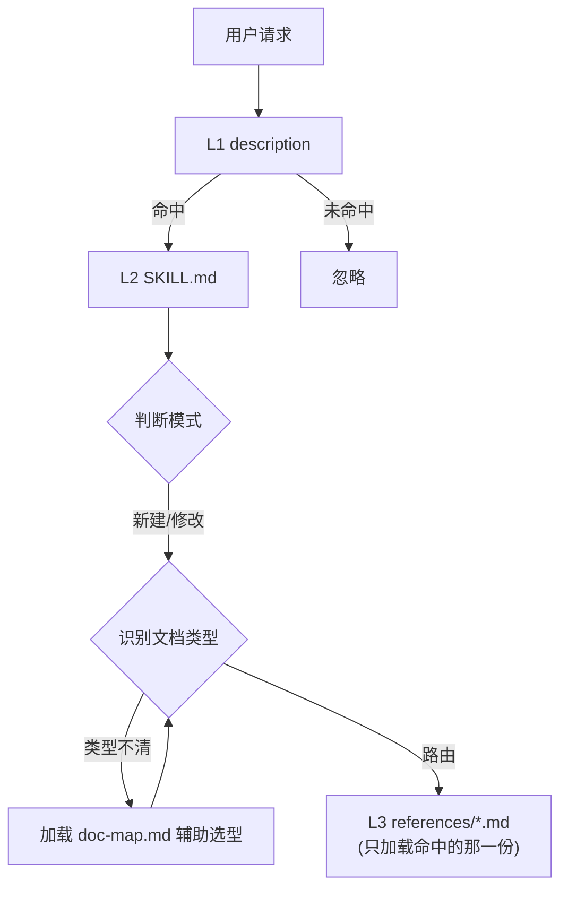

# scribe 架构设计

## 概述

scribe 是一个面向 AI agent 的文档编写 skill。它不含可执行代码,本质是一组**结构化的提示词与参考指南**:通过分层加载机制,让 agent 在不同文档任务中按需获取对应的写作规范,从而稳定产出符合社区最佳实践的开发者文档。

## 目标与非目标

- **目标**
  - 覆盖开发全周期的文档撰写需求,每类文档职责清晰、边界不重叠
  - 兼容任何支持 Agent Skills 标准的工具(pi、Claude Code、Codex)
  - 让 agent 按需加载规范,避免一次性把所有规范塞进上下文
- **非目标**
  - 不生成业务代码(写代码不需要本 skill)
  - 不做从代码注释全量自动生成文档(交给 TypeDoc/Sphinx/JSDoc)
  - 不做长篇博客/教程等内容创作

## 整体架构

scribe 采用 Agent Skills 的**三层渐进式加载(L1/L2/L3)**架构:

| 层 | 载体 | 职责 | 何时加载 |
|----|------|------|---------|
| **L1** | `SKILL.md` frontmatter(name + description) | 让 agent 判断"这个任务要不要用 scribe" | 始终在上下文 |
| **L2** | `SKILL.md` 正文 | 工作流程:判断模式 → 识别类型 → 收集上下文 → 路由到 L3 | 命中 skill 后加载 |
| **L3** | `references/*.md` | 每类文档的具体写作规范 | 按文档类型**按需**加载 |

核心机制是 **L2 的路由**:L2 持有两张表(文档类型识别表、L3 加载表),根据用户意图把任务导向对应的 L3 文件。L3 之间互不依赖,各自独立。

## 关键设计决策

- **为什么分三层而不是单文件**:把规范全写进 SKILL.md 会让每次任务都加载全部内容,浪费上下文。按需加载只取当前文档类型的规范。详见 [ADR-0001](adr/0001-three-tier-architecture.md)。
- **为什么去掉 agent 专属字段**:早期 frontmatter 含 `compatibility`、`metadata` 等字段,绑定特定 agent。通用化后只留 `name`/`description`/`license`,换取跨工具兼容。详见 [ADR-0002](adr/0002-vendor-neutral-frontmatter.md)。
- **为什么单设 doc-map.md**:文档"边界"是横切关注点,分散在各 L3 会互相矛盾。抽出总览作为单一信息源。详见 [ADR-0003](adr/0003-doc-map-as-single-source.md)。

## 关键流程

**新建一份文档**(以"写 README"为例):
1. L1 description 命中文档相关意图 → 加载 L2
2. L2 判断为"新建"模式
3. L2 用识别表把"readme/项目说明"匹配到 `README` 类型
4. L2 用加载表加载 `references/readme.md`
5. 依规范收集上下文、生成、审阅迭代

**修改/规范现有文档**:L2 判定为修改模式 → 加载 `references/modify-doc.md` → 先识别类型与 agent 环境 → 加载对应 L3 → 诊断→确认→执行。

## 权衡与已知限制

- **规范靠人维护,可能与社区标准漂移**:L3 是手写规范,外部最佳实践演进时需手动跟进。
- **新增一类文档需同步 5 处**(SKILL.md×2、modify-doc.md、README、trigger-examples),易遗漏——靠 CONTRIBUTING 的"5 处同步"清单约束。
- **L1 description 的触发词决定召回率**:词不全会导致该触发时没触发,是当前最脆弱的一环。
