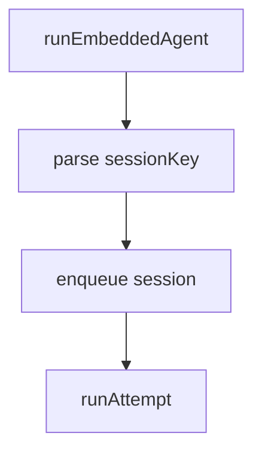

# Multi-file 设计笔记（项目设计学习笔记）编写指南

> 设计文档的**多文件变体**：当项目源码 ≥ 5000 行、主题 ≥ 5、需要按主题族分组管理时，把单个设计文档拆成"根 README 索引 + 编号主题文件夹 + 编号子文档"的结构。
>
> 适用读者：贡献者、未来的自己、AI agent —— 用来快速理解大型项目的整体架构与代码锚点。

## 定位

Multi-file 设计笔记是 [`design-doc.md`](design-doc.md) 的**专门形态**，不是替代：

| 维度 | 单文件设计文档 | Multi-file 设计笔记 |
|------|--------------|-------------------|
| 适用项目 | 中小型（< 5000 行） | 大型（≥ 5000 行） |
| 主题数量 | < 5 | ≥ 5 |
| 文件结构 | 单个 `.md` 文件 | 根 README + 编号文件夹 + 编号子文件 |
| 代码引用 | 选做 | **强制** `file:line` |
| 与 README 关系 | 可独立成文 | 通常作为 `docs/design-notes/` 子目录 |
| 维护成本 | 低（同步整篇） | 中（按主题独立更新） |

判断该用哪个：

```
源码 ≥ 5000 行 + 主题 ≥ 5?
├─ 是 → Multi-file 设计笔记（本文档）
└─ 否 → 单文件设计文档（见 design-doc.md）
```

## 与其他文档的边界

参考 [`doc-map.md`](doc-map.md) 的设计文档定位：

- **与单文件设计文档**：都是"系统为什么这么设计、模块如何划分、关键权衡"。Multi-file 是单文件的拆分版，按主题族分组维护。
- **与 ADR**：multi-file 笔记描述**整体架构现状**，ADR 记录**单个决策始末**。笔记中遇到重大决策，链接到对应 ADR，不在笔记里展开辩论。
- **与 README**：README 回答"怎么用"（用户视角），笔记回答"为什么这样设计、代码在哪里"（贡献者视角）。两者职责不重叠。
- **与 API 文档**：API 文档讲"接口怎么调"，笔记讲"内部模块怎么协作"。两者互补。
- **与项目级编排（[`project-setup.md`](project-setup.md)）**：正交关系。project-setup 管"项目该有哪几类文档"（广度），multi-file 笔记管"设计文档这一类怎么拆"（深度）。可组合：先 project-setup 初始化整套文档，再对设计文档选 multi-file 形态。

## 目录结构

```
docs/design-notes/   （或用户指定路径）
├── README.md                  ← 根索引：一句话总结、怎么读、编辑约定、incident anchor 表
├── 00-overview/               ← 概览族
│   ├── 00-one-sentence-summary.md
│   ├── 01-architecture-map.md
│   └── 02-entry-points.md
├── 10-{runtime}/              ← 主题族 1：核心运行时
│   ├── 00-{main}.md
│   ├── 01-{sub}.md
│   └── ...
├── 20-{capabilities}/         ← 主题族 2：能力扩展
├── 30-{hooks}/                ← 主题族 3：钩子 / 生命周期 / Deep dive
├── 40-{persistence}/          ← 主题族 4：持久化
├── 50-{config}/               ← 主题族 5：配置
├── 60-{safety}/               ← 主题族 6：安全
├── 70-{observability}/        ← 主题族 7：可观测
├── 80-{cross-cutting}/        ← 主题族 8：跨切面模式
├── 90-{rebuild-checklist}/    ← 主题族 9：重建清单
└── 99-{references}/           ← 主题族 10：配套引用
```

### 编号方案

两位数字前缀 = 主题族：

| 前缀 | 主题族 | 典型内容 |
|---|---|---|
| `00-` | 概览 | 一句话总结、架构图、入口清单 |
| `10-19` | 核心运行时 | run loop、queue、harness、modes |
| `20-29` | 能力扩展 | plugins、skills、MCP、channels |
| `30-39` | 钩子 / 生命周期 / Deep dive | 钩子注册、合并、deep dive 主题 |
| `40-49` | 持久化 | session、memory、compaction |
| `50-59` | 配置 / 凭据 | 配置分层、密钥管理 |
| `60-69` | 安全 / 可靠性 / 隔离 | sandbox、failover、write-lock |
| `70-79` | 可观测 | 用量、重放、事件流、metrics |
| `80-89` | 跨切面模式 / 反模式 / 命名 | 设计模式、命名约定 |
| `90-99` | 重建清单 / 配套参考 | rebuild checklist、外部参考 |

**约束**：

- 同族可递增插入编号（`10-runtime/` → `11-streaming-and-delivery/` → ...）
- 文件夹命名：`NN-kebab-case-name`，描述清楚主题（避免缩写）
- 文件夹内子文档用 `NN-NN-{topic}.md` 双段编号：族号-族内序号
- 子文档起手文件名约定：
  - `00-{main}.md` — 该主题最核心的说明
  - `01-...` `02-...` 视主题复杂度递增

**00-overview/ 必含子文档**：

- `00-one-sentence-summary.md` — 一句话总结项目本质
- `01-architecture-map.md` — 文字版架构图（缩进树状 或 mermaid）
- `02-entry-points.md` — 入口文件清单（带 `file:line`）

## 单文档模板

```markdown
# NN. 主题标题

> 主文件：`path/to/main-file.ts`（4212 行）
> 相关文件：`path/to/related.ts`、`path/to/another.ts`

## 整体形状

（流程描述：可用 mermaid 流程图，或 ASCII 树状图描述核心调用栈）



代码锚点：

```ts
// path/to/file.ts:111-123
const COMMAND_QUEUE_STATE_KEY = ***"openclaw.commandQueueState");
```

## 数据结构

```ts
// harness/types.ts:99-138
type AgentHarness = {
  id: string;
  // ...
};
```

## 适用场景 / 触发条件 / 反直觉决策

（按主题选 2-3 个相关章节，每个章节 1-3 段，引用 `file:line`）

## 表格（可选）

| 列 1 | 列 2 | 列 3 |
|---|---|---|
| ... | ... | ... |
```

**强制规则**：

- 标题格式：`# NN. 主题标题`（NN 为该主题的族内编号）
- 第二行一定是 `> 主文件：path/to/file.ts` blockquote
- 每个代码块必须带 `// file:line-line` 注释
- 不写"在这里调用了 xxx"这种抽象描述，必须有 `file:line` 锚点
- 流程图：参考 [`general-principles.md`](general-principles.md)，除目录结构外一律用 mermaid

## 根 README.md 模板

```markdown
# {项目名} 设计学习笔记

> 一份从代码出发、以学习为目的的架构梳理。{项目} 位于 `{path}`。
> 引用以 `file:line` 形式给出，可点击跳转。所有行号基于调查时的工作树（{YYYY/MM/DD}）。

## 一句话总结

{一句话说明项目本质}

## 怎么读这份笔记

按"先骨架后细节"的顺序：

### 概览
1. **[`00-overview/`](./00-overview/)** — 一句话总结、架构分层图、各入口

### {主题族 1}
2. **[`10-{topic}/`](./10-{topic}/)** — 一句话说明
3. **[`11-{topic}/`](./11-{topic}/)** — 一句话说明

### {主题族 2}
4. **[`20-{topic}/`](./20-{topic}/)** — 一句话说明

（按编号顺序列出**所有**主题文件夹，每条带 1 句话说明）

## 关键 incident anchor（贯穿全笔记）

| Issue | 位置 | 教训 |
|---|---|---|
| **{#48534}** | `hooks.ts:222-233` | legacy compat hook 不能 unbounded |
| **{#41981}** | `compaction-safeguard.ts:907-917` | cancel 会 re-trigger loop；写 boundary |

## 这份笔记不覆盖什么

- 编码风格 / lint / 测试配置等根 `AGENTS.md` 已经管的事
- 单个 provider 的协议细节（私有知识）
- UI 细节（与 agent runtime 解耦时）
- release 流程、PR 流程、commit message 约定

## 笔记编辑约定

- 文件内代码引用形式：`<相对路径>:N` 或 `src/agents/foo.ts:NN`。
- 设计模式讨论集中在 `80-cross-cutting-patterns/`。
- 不在本笔记里复述 `AGENTS.md` 的硬规则——项目自己已经写得很好。
- 流程图一律用 mermaid（参考 general-principles.md）。
```

**强制规则**：

- 根 README 必须包含：标题、引用说明、一句话总结、怎么读、incident anchor 表、不覆盖什么、编辑约定
- "怎么读" 章节按编号顺序列出**所有**主题文件夹
- incident anchor 表：把代码里见到的 issue 号（注释里、TODO 旁边、`<!-- anchor: -->` 标记处）集中列出

## 风格要点

- **代码锚点是命脉**：每个流程、每个数据结构、每个反直觉决策都带 `file:line`
- **简洁**：每段话只表达一个意思；每个章节只负责一个主题
- **可执行 > 抽象**：写"`src/agents/run.ts:629` 处理了 backfill"，而不是 "处理 backfill"
- **图表优先**：流程描述优先用 mermaid（参考 `general-principles.md`）；分类对比用表格
- **不重复 AGENTS.md**：项目自身的硬规则不在笔记里复述
- **错误 / 反直觉决策要标记**：注释里、`incident anchor` 表里、单独的"反直觉决策"小节

## 与 Harness 6 框架的集成

按 [`SKILL.md`](../SKILL.md) 的 6 Phase 管道执行 multi-file 笔记的撰写：

| Phase | 操作要点（multi-file 特化） |
|---|---|
| **Phase 0 Intake** | 识别"设计笔记 / multi-file 设计笔记"信号词；走新建模式；目标路径通常为 `docs/design-notes/`；先检查该目录是否已存在 |
| **Phase 1 Context** | 加载本文档作为 L3 参考；不加载单文件 `design-doc.md` |
| **Phase 2 Plan** | plan.md 必须包含三段：①主题清单 + 编号方案 ②00-overview/ 子文档清单 ③根 README 板块清单。**先给用户确认编号方案再开建文件夹** |
| **Phase 3 Draft** | 先建 `00-overview/`，再建各主题文件夹（按编号顺序），最后写根 README。每个子文档单独走 Draft → 自查 → 写完下一个 |
| **Phase 4 Review** | **复杂文档**：用 SubAgent 评审，prompt 包含"编号方案是否合理"、"子文档职责是否清晰"、"代码锚点是否齐全"。**简单小节**：主 Agent 内联自查 |
| **Phase 5 Revise** | 最小切片修复：哪个子文档的哪一段有问题改哪段，不要重写整篇 |
| **Phase 6 Deliver** | 写入 `docs/design-notes/`；告知用户每个文件夹的简短说明 |

### Phase 3 Draft 自查（multi-file 特化）

初稿每个子文档写完后，参考 [`review-checklist.md`](review-checklist.md) 的 Draft 自查段，外加：

1. **编号方案符合规范吗**？是否落在正确的主题族前缀（00/10-19/20-29/...）？
2. **`file:line` 锚点齐全吗**？每个代码块前都有吗？
3. **子文档之间的引用是否有效**？如 `[`10-runtime/00-run-loop.md`](./10-runtime/00-run-loop.md)` 是否能点开？
4. **00-overview/ 是否包含**：`00-one-sentence-summary.md` + `01-architecture-map.md` + `02-entry-points.md`？

按结论修复后再进入下一个子文档。

## 编辑工作流

生成笔记时遵循以下顺序：

1. **扫描代码** — 列顶层目录、找入口文件、识别核心模块
2. **输出主题清单 + 编号方案** — 给用户审阅确认
3. **先建 `00-overview/`** — 一句话总结、架构图、入口清单
4. **再建主题文件夹** — 按编号顺序，先建核心运行时（10-19），再扩展
5. **最后写根 `README.md`** — 把所有主题串成可读路径
6. **incident anchor 表** — 整理代码里发现的 issue 号
7. **审阅迭代** — 让用户指出增删

## 何时不用这个风格

| 场景 | 用其他参考 |
|---|---|
| 项目 < 5000 行 | 单文件 [`design-doc.md`](design-doc.md) |
| 用户只要一个 README | [`readme.md`](readme.md) |
| 单个决策的始末 | [`adr.md`](adr.md) |
| API 接口怎么调 | [`api-doc.md`](api-doc.md) |
| 用户说"写设计笔记"但项目小 | 退化为单文件 `design-doc.md` |
| 用户说"我建了个新项目，缺哪些文档" | [`project-setup.md`](project-setup.md) |

## 修改现有笔记

参考 [`modify-doc.md`](modify-doc.md)：

- **局部修改**（改某个子文档某段）：直接编辑，保留编号
- **新增主题**：选下一个可用编号插入；同步更新根 README 的"怎么读"章节
- **重排编号**：成本高，需要同步更新所有内部链接；不推荐，除非重整
- **拆分 / 合并子文档**：拆出去的给新 `NN-{topic}.md`；合并的被合并方删除，主方增补内容

修改模式 Phase 2 Plan 基于现有笔记诊断：从 `.scribe/plan.md` 列出每个改动的影响范围（哪些子文档、根 README、incident anchor 表），用户确认后再动笔。