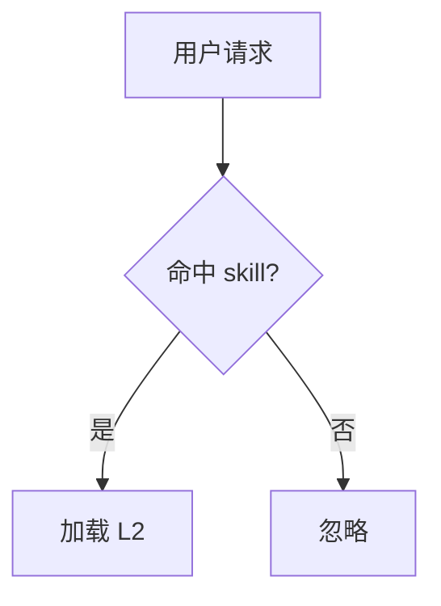

# 通用文档写作原则

当用户请求的文档类型不在预定义的 L3 参考资料中时，使用以下通用原则指导写作。

## 三步法

### 1. 确定受众
- **写给谁看**：AI agent？新成员？资深开发者？外部用户？
- **他们关心什么**：会问什么问题？会遇到什么阻碍？
- **他们不会关心什么**：删掉对受众无价值的内容

### 2. 确定结构
常见文档结构模式：

| 文档性质 | 核心章节 |
|---------|---------|
| 入门指南 | 概述 → 安装 → 快速开始 → 下一步 |
| 操作手册 | 概述 → 前置条件 → 步骤 → 验证 → 故障排除 |
| 参考文档 | 概述 → 每个条目：签名 + 说明 + 参数 + 返回值 + 示例 |
| 规范/约定 | 概述 → 规则列表（每组：是什么 + 为什么 + 示例） |
| 决策记录 | 背景 → 问题 → 方案 → 后果 |

### 3. 填充内容
- 从已知信息开始
- 不确定的留 `<!-- TODO -->`
- 优先写可执行的命令和示例
- 用事实代替形容词

## 通用写作检查清单

- [ ] 一句话能说清文档的用途
- [ ] 目录清晰（长文档必须有 TOC）
- [ ] 命令可直接复制运行
- [ ] 示例真实可用（不是伪代码）
- [ ] 没有未定义的术语
- [ ] 没有无意义的形容词（"强大的"、"灵活的"）
- [ ] 格式一致（代码块语言标注、标题层级）
- [ ] 不确定的内容用 `<!-- TODO -->` 标注

## 语气和措辞

| 场景 | 推荐 | 避免 |
|------|------|------|
| 指令 | "运行 `npm test`" | "你应该运行测试" |
| 说明 | "配置文件在 `config/app.json`" | "配置文件位于 config 目录下的 app.json 文件中" |
| 限制 | "仅支持 Node.js 18+" | "请注意，此工具不支持低于 Node.js 18 的版本" |
| 警告 | "**破坏性变更**：需要手动迁移" | "这个版本有一些不兼容的修改，用户需要做一些额外的工作" |

原则：**简短直接 > 礼貌委婉**。文档不是社交场合，效率优先。

## 图表规范

文档需要画图时，遵循以下规则：

- **目录 / 文件结构**：用 ASCII 树（` ├──  └──`），简单直观，无需渲染。
- **其余所有图一律用 [mermaid](https://mermaid.js.org/)**：流程图、架构/模块图、时序图、状态图、ER 图、甘特图等。mermaid 是代码，能随文档版本化、在 GitHub 等平台自动渲染，比 ASCII art 美观且易维护。

不要用 ASCII art 画流程图、框图、箭头连线——难维护、易错位。例如：

```markdown
<!-- ✅ 目录结构用 ASCII 树 -->
src/
├── index.js
└── utils/

<!-- ✅ 流程 / 架构 / 时序图用 mermaid -->


<!-- ❌ 不要用 ASCII art 画流程图 -->
用户请求 ──▶ 命中? ──▶ 加载 L2
```
